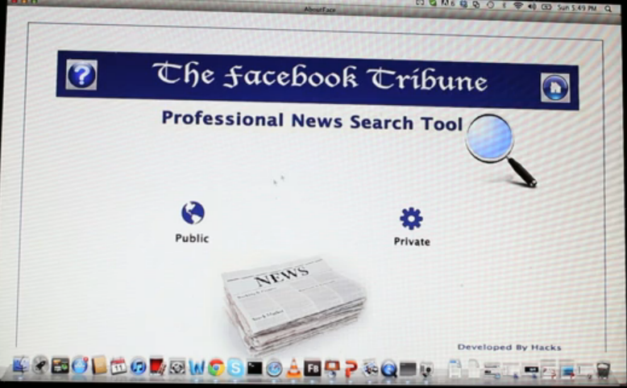

Facebook Tribune
================

What if Facebook's news feed was just that – a stream of information which was purely newsworthy? Posts from reputed news organizations, such as NYTimes, WSJ, and BBC, inform people about what is happening in our world in a simple, uncluttered way. Our team designed The Facebook Tribune – a new way of reading the news in a way that makes more sense to readers. Flash Builder and FB API are the major tools for developing this app.

 

Ideas:
- User Interface Redesign 
- Facebook Newsfeed 
- Usability Testing

Tools:
- Flex Builder (Adobe Flash Builder)
- ActionScript 
- Facebook API 

Teams:
- Shujian Bu
- Meron Gribetz 
- Pucong Han 
- Rashmi Raman
- Robert Walport

Videos:
- https://vimeo.com/62477199
